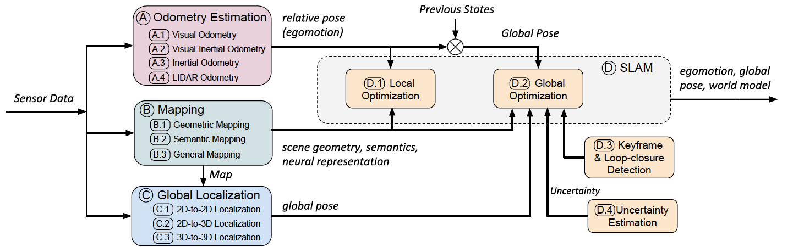

# Deep Learning for Localization and Mapping

This repository is a collection of deep learning based localization and mapping approaches. A survey on Deep Learning for Visual Localization and Mapping is offered in the following paper:

>Deep Learning for Visual Localization and Mapping: A Survey
 >
 >[Changhao Chen](https://changhao-chen.github.io/), [Bing Wang](https://www.cs.ox.ac.uk/people/bing.wang/), [Chris Xiaoxuan Lu](https://christopherlu.github.io/), [Niki Trigoni](https://www.cs.ox.ac.uk/people/niki.trigoni/) and [Andrew Markham](https://www.cs.ox.ac.uk/people/andrew.markham/)
 >
 >**IEEE Transactions on Neural Networks and Learning Systems** [[PDF](https://arxiv.org/abs/2308.14039)]

A survey on Deep Learning for Inertial Positioning is offered in the following paper:

>Deep Learning for Inertial Positioning: A Survey
 >
 >[Changhao Chen](https://changhao-chen.github.io/), Xianfei Pan
 >
 >**IEEE Transactions on Intelligent Transportation Systems** [[PDF](https://arxiv.org/abs/2303.03757)]

Previous Version.

>A Survey on Deep Learning for Localization and Mapping: Towards the Age of Spatial Machine Intelligence
 >
 >[Changhao Chen](https://changhao-chen.github.io/), [Bing Wang](https://www.cs.ox.ac.uk/people/bing.wang/), [Chris Xiaoxuan Lu](https://christopherlu.github.io/), [Niki Trigoni](https://www.cs.ox.ac.uk/people/niki.trigoni/) and [Andrew Markham](https://www.cs.ox.ac.uk/people/andrew.markham/)
 >
 >**arXiv:2006.12567** [[PDF](https://arxiv.org/abs/2006.12567)]

## News
### Update: Jun-22-2020
- We released our survey paper.
### Update: Aug-30-2023
- Our Survey "Deep Learning for Visual Localization and Mapping: A Survey" was accepted to IEEE TNNLS.
### Update: Mar-13-2024
- Our Survey "Deep Learning for Inertial Positioning: A Survey" was accepted to IEEE TITS.

## TO DO

## Category
- [Odometry Estimation](#Odometry-Estimation)
  - [Visual Odometry](#Visual-Odometry)
  - [Visual-Inertial Odometry](#Visual-Inertial-Odometry)
  - [Inertial Odometry](#Inertial-Odometry)
  - [LIDAR Odometry](#LIDAR-Odometry)
- [Mapping](#Mapping)
  - [Geometric Mapping](#Geometric-Mapping)
  - [Semantic Mapping](#Semantic-Mapping)
  - [General Mapping](#General-Mapping)
- [Global localization](#Global-Localization)
  - [2D-to-2D Localization](#2D-to-2D-Localization)
  - [2D-to-3D Localization](#2D-to-3D-Localization)
  - [3D-to-3D Localization](#3D-to-3D-Localization)
- [Simultaneous Localization and Mapping (SLAM)](#SLAM)
  - [Local Optimization](#Local-Optimization)
  - [Global Optimization](#Global-Optimization)
  - [Keyframe and Loop-closure Detection](#Keyframe-and-Loop-closure-Detection)
  - [Uncertainty Estimation](#Uncertainty-Estimation)

## If you find this repository useful, please cite our paper:
 
    @misc{chen2020survey,
    title={A Survey on Deep Learning for Localization and Mapping: Towards the Age of Spatial Machine Intelligence},
    author={Changhao Chen and Bing Wang and Chris Xiaoxuan Lu and Niki Trigoni and Andrew Markham},
    year={2020},
    eprint={2006.12567},
    archivePrefix={arXiv},
    primaryClass={cs.CV}
    }

  
## Categorized by Topic
*The Date in the table denotes the publication date (e.g. date of conference).
### Odometry Estimation
#### Visual Odometry
| Models   |Date| Publication| Paper | Code |
|----------|----|------------|------|---|
| Konda et al. | 2015 | VISAPP | [Learning visual odometry with a convolutional network](https://www.iro.umontreal.ca/~memisevr/pubs/VISAPP2015.pdf) | |
| Costante et al. | 2016 | RA-L | [Exploring Representation Learning With CNNs for Frame-to-Frame Ego-Motion Estimation](https://ieeexplore.ieee.org/document/7347378) | |
| Backprop KF | 2016 | NeurIPS | [Backprop KF: Learning Discriminative Deterministic State Estimators](https://arxiv.org/abs/1605.07148) | |
| DeepVO | 2017 | ICRA | [DeepVO: Towards End-to-End Visual Odometry with Deep Recurrent Convolutional Neural Networks](https://arxiv.org/abs/1709.08429) | |
| SfmLearner | 2017 | CVPR | [unsupervised learning of depth and ego-motion from video](http://openaccess.thecvf.com/content_cvpr_2018/papers/Mahjourian_Unsupervised_Learning_of_CVPR_2018_paper.pdf) | [TF](https://github.com/tinghuiz/SfMLearner) [PT](https://github.com/ClementPinard/SfmLearner-Pytorch)|
| Yin et al. | 2017 | ICCV | [Scale Recovery for Monocular Visual Odometry Using Depth Estimated With Deep Convolutional Neural Fields](http://openaccess.thecvf.com/content_ICCV_2017/papers/Yin_Scale_Recovery_for_ICCV_2017_paper.pdf) | |
| UnDeepVO | 2018 | ICRA | [UnDeepVO: Monocular Visual Odometry through Unsupervised Deep Learning](https://arxiv.org/abs/1709.06841) | |
| Barnes et al. | 2018 | ICRA | [Driven to Distraction: Self-Supervised Distractor Learning for Robust Monocular Visual Odometry in Urban Environments](https://arxiv.org/abs/1711.06623) | |
| GeoNet | 2018 | CVPR | [GeoNet: Unsupervised Learning of Dense Depth, Optical Flow and Camera Pose](https://arxiv.org/abs/1803.02276) | [TF](https://github.com/yzcjtr/GeoNet) |
| Zhan et al. | 2018 | CVPR | [Unsupervised Learning of Monocular Depth Estimation and Visual Odometry with Deep Feature Reconstruction](https://arxiv.org/abs/1803.03893) | [Caffe](https://github.com/Huangying-Zhan/Depth-VO-Feat) |
| DPF | 2018 | RSS | [Differentiable Particle Filters: End-to-End Learning with Algorithmic Priors](https://arxiv.org/abs/1805.11122) | [TF](https://github.com/tu-rbo/differentiable-particle-filters) |
| Yang et al. | 2018 | ECCV | [Deep Virtual Stereo Odometry: Leveraging Deep Depth Prediction for Monocular Direct Sparse Odometry](https://arxiv.org/abs/1807.02570) | |
| Zhao et al. | 2018 | IROS | [Learning monocular visual odometry with dense 3d mapping from dense 3d flow](https://arxiv.org/abs/1803.02286) | |
| Turan et al. | 2018 | IROS | [Unsupervised Odometry and Depth Learning for Endoscopic Capsule Robots](https://arxiv.org/pdf/1803.01047.pdf) | |
| Struct2Depth | 2019 | AAAI | [Depth Prediction Without the Sensors: Leveraging Structure for Unsupervised Learning from Monocular Videos](https://arxiv.org/abs/1811.06152) | [TF](https://github.com/tensorflow/models/tree/master/research/struct2depth) |
| Saputra et al.| 2019 | ICRA | [Learning monocular visual odometry through geometry-aware curriculum learning](https://arxiv.org/abs/1903.10543) | |
| GANVO | 2019 | ICRA | [GANVO: Unsupervised deep monocular visual odometry and depth estimation with generative adversarial networks](https://arxiv.org/abs/1809.05786) | |
| CNN-SVO | 2019 | ICRA | [CNN-SVO: Improving the Mapping in Semi-Direct Visual Odometry Using Single-Image Depth Prediction](https://ieeexplore.ieee.org/document/8794425) | [ROS](https://github.com/yan99033/CNN-SVO) |
| Li et al. | 2019 | ICRA | [Pose graph optimization for unsupervised monocular visual odometry](https://arxiv.org/abs/1903.06315) | |
| Xue et al.| 2019 | CVPR | [Beyond tracking: Selecting memory and refining poses for deep visual odometry](https://arxiv.org/abs/1904.01892) | |
| Wang et al.| 2019 | CVPR | [Recurrent neural network for (un-) supervised learning of monocular video visual odometry and depth](https://arxiv.org/abs/1904.07087) | |
| Li et al. | 2019 | ICCV | [Sequential adversarial learning for self-supervised deep visual odometry](https://arxiv.org/abs/1908.08704) | |
| Saputra et al. | 2019 | ICCV | [Distilling knowledge from a deep pose regressor network](https://arxiv.org/abs/1908.00858) | |
| Gordon et al. | 2019 | ICCV | [Depth from videos in the wild: Unsupervised monocular depth learning from unknown cameras](https://arxiv.org/abs/1904.04998) | [TF](https://github.com/google-research/google-research/tree/master/depth_from_video_in_the_wild) |
|  Koumis et al. | 2019 | IROS | [Estimating Metric Scale Visual Odometry from Videos using 3D Convolutional Networks](https://jpreiss.github.io/pubs/Koumis_Preiss_3DCVO_IROS2019.pdf) | |
| Bian et al. | 2019 | NeurIPS | [Unsupervised Scale-consistent Depth and Ego-motion Learning from Monocular Video](https://papers.nips.cc/paper/8299-unsupervised-scale-consistent-depth-and-ego-motion-learning-from-monocular-video.pdf) | [PT](https://github.com/JiawangBian/SC-SfMLearner-Release) |
| D3VO | 2020 | CVPR | [D3VO: Deep Depth, Deep Pose and Deep Uncertainty for Monocular Visual Odometry](https://arxiv.org/pdf/2003.01060.pdf#page=9&zoom=100,412,902) | |
| Jiang et al. | 2020 | CVPR | [Joint Unsupervised Learning of Optical Flow and Egomotion with Bi-Level Optimization](https://arxiv.org/pdf/2002.11826.pdf) | |

#### Visual-Inertial Odometry
| Models   |Date| Publication| Paper | Code |
|----------|----|------------|------|---|
| VINet | 2017 | AAAI | [VINet: Visual-Inertial Odometry as a Sequence-to-Sequence Learning Problem](https://arxiv.org/abs/1701.08376) | |
| VIOLearner | 2019 | TPAMI | [Unsupervised deep visual-inertial odometry with online error correction for rgb-d imagery](https://ieeexplore.ieee.org/document/8691513) | |
| SelectFusion | 2019 | CVPR | [Selective Sensor Fusion for Neural Visual-Inertial Odometry](https://arxiv.org/abs/1903.01534) | |
| DeepVIO | 2019 | IROS | [DeepVIO: Self-supervised deep learning of monocular visual inertial odometry using 3d geometric constraints](https://arxiv.org/abs/1906.11435) | |

#### Inertial Odometry
| Models   |Date| Publication| Paper | Code |
|----------|----|------------|------|---|
| IONet | 2018 | AAAI | [IONet: Learning to Cure the Curse of Drift in Inertial Odometry](https://arxiv.org/abs/1802.02209) | |
| RIDI | 2018 | ECCV | [RIDI: Robust IMU Double Integration](https://arxiv.org/abs/1712.09004) | [Py](https://github.com/higerra/ridi_imu) |
| Wagstaff et al. | 2018 | IPIN | [LSTM-Based Zero-Velocity Detection for Robust Inertial Navigation](https://ieeexplore.ieee.org/abstract/document/8533770) | [PT](https://github.com/utiasSTARS/pyshoe) |
| Cortes et al. | 2019 | MLSP | [Deep Learning Based Speed Estimation for Constraining Strapdown Inertial Navigation on Smartphones](https://ieeexplore.ieee.org/abstract/document/8516710) | |
| MotionTransformer| 2019 | AAAI | [MotionTransformer: Transferring Neural Inertial Tracking between Domains](https://www.aaai.org/ojs/index.php/AAAI/article/view/4802) | |
| AbolDeepIO | 2019 | TITS | [AbolDeepIO: A Novel Deep Inertial Odometry Network for Autonomous Vehicles](https://ieeexplore.ieee.org/abstract/document/8693766) | |
| Brossard et al. | 2019 | ICRA | [Learning wheel odometry and imu errors for localization](https://hal.archives-ouvertes.fr/hal-01874593/document) | |
| OriNet | 2019 | RA-L | [OriNet: Robust 3-D Orientation Estimation With a Single Particular IMU](https://ieeexplore.ieee.org/abstract/document/8931590) | [PT](https://github.com/mbrossar/denoise-imu-gyro) |
| L-IONet | 2020| IoT-J | [Deep Learning based Pedestrian Inertial Navigation: Methods, Dataset and On-Device Inference](https://arxiv.org/abs/2001.04061) | |

#### LIDAR Odometry
| Models   |Date| Publication| Paper | Code |
|----------|----|------------|------|---|
| Velas et al. | 2018 | ICARSC | [CNN for IMU Assisted Odometry Estimation using Velodyne LiDAR](https://arxiv.org/abs/1712.06352) | | 
| LO-Net | 2019 | CVPR | [LO-Net: Deep Real-time Lidar Odometry](https://arxiv.org/abs/1904.08242) | |
| DeepPCO | 2019 | IROS | [DeepPCO: End-to-End Point Cloud Odometry through Deep Parallel Neural Network](https://arxiv.org/abs/1910.11088) | |
| Valente et al. | 2019 | IROS | [Deep sensor fusion for real-time odometry estimation](https://ieeexplore.ieee.org/document/8967803) | |

### Mapping
#### Geometric Mapping
##### Depth Representation
* Joint learning of depth and ego-motion has been discussed in Visual Odometry. We do not include these works here, although they can produce depth representation.

| Models   |Date| Publication| Paper | Code |
|----------|----|------------|------|---|
| Eigen et al. | 2014 | NeurIPS | [Depth Map Prediction from a Single Image using a Multi-Scale Deep Network](https://papers.nips.cc/paper/5539-depth-map-prediction-from-a-single-image-using-a-multi-scale-deep-network.pdf) | |
| Liu et al. | 2015 | TPAMI | [Learning depth from single monocular images using deep convolutional neural fields](https://arxiv.org/abs/1502.07411) | |
| Garg et al. | 2016 | ECCV | [Unsupervised cnn for single view depth estimation: Geometry to the rescue](https://arxiv.org/abs/1603.04992) | |
| Demon | 2017 | CVPR | [Demon: Depth and motion network for learning monocular stereo](https://arxiv.org/abs/1612.02401) | |
| Godard et al. | 2017 | CVPR | [Unsupervised monocular depth estimation with left-right consistency](https://arxiv.org/abs/1609.03677) | |
| Wang et al. | 2018 | CVPR | [Learning depth from monocular videos using direct methods](https://arxiv.org/abs/1712.00175) | |

##### Voxel Representation
| Models   |Date| Publication| Paper | Code |
|----------|----|------------|------|---|
| SurfaceNet | 2017 | CVPR | [SurfaceNet: An End-to-end 3D Neural Network for Multiview Stereopsis](https://arxiv.org/abs/1708.01749) | |
| Dai et al. | 2017 | CVPR | [Shape completion using 3d-encoder-predictor cnns and shape synthesis](https://arxiv.org/abs/1612.00101) | |
| Hane et al. | 2017 | 3DV | [Hierarchical surface prediction for 3d object reconstruction](https://arxiv.org/abs/1704.00710) | |
| OctNetFusion | 2017 | 3DV | [Octnetfusion: Learning depth fusion from data](https://arxiv.org/abs/1704.01047) | |
| OGN | 2017 | ICCV | [Octree generating networks: Efficient convolutional architectures for high-resolution 3d outputs](https://arxiv.org/abs/1703.09438) | |
| Kar et al. | 2017 | NeurIPS | [Learning a multi-view stereo machine](https://arxiv.org/abs/1708.05375) | |
| RayNet | 2018 | CVPR | [RayNet: Learning Volumetric 3D Reconstruction with Ray Potentials](https://arxiv.org/abs/1901.01535) | |

##### Point Representation
| Models   |Date| Publication| Paper | Code |
|----------|----|------------|------|---|
| Fan et al. | 2017 | CVPR | [A point set generation network for 3d object reconstruction from a single image](https://arxiv.org/abs/1612.00603) | |

##### Mesh Representation
| Models   |Date| Publication| Paper | Code |
|----------|----|------------|------|---|
| Ladicky et al. | 2017 | ICCV | [From point clouds to mesh using regression](https://ieeexplore.ieee.org/document/8237682) | |
| Mukasa et al. | 2017 | ICCVW | [3d scene mesh from cnn depth predictions and sparse monocular slam](http://openaccess.thecvf.com/content_ICCV_2017_workshops/papers/w17/Mukasa_3D_Scene_Mesh_ICCV_2017_paper.pdf) | |
| Wang et al. | 2018 | ECCV | [Pixel2mesh: Generating 3d mesh models from single rgb images](https://arxiv.org/abs/1804.01654) | |
| Groueix et al. | 2018 | CVPR | [AtlasNet: A Papier-Mâché Approach to Learning 3D Surface Generation](https://arxiv.org/abs/1802.05384) | |
| Scan2Mesh | 2019 | CVPR | [Scan2mesh: From unstructured range scans to 3d meshes](https://arxiv.org/abs/1811.10464) | |
| Bloesch et al. | 2019 | ICCV | [Learning meshes for dense visual SLAM](https://www.imperial.ac.uk/media/imperial-college/research-centres-and-groups/dyson-robotics-lab/mbloesch_etal_iccv2019.pdf) | |

#### Semantic Mapping
| Models   |Date| Publication| Paper | Code |
|----------|----|------------|------|---|
| SemanticFusion | 2017 | ICRA | [Semanticfusion: Dense 3d semantic mapping with convolutional neural networks](https://arxiv.org/abs/1609.05130) | |
| DA-RNN | 2017 | RSS | [DA-RNN: Semantic mapping with data associated recurrent neural networks](https://arxiv.org/abs/1703.03098) | |
| Ma et al. | 2017 | IROS | [Multi-view deep learning for consistent semantic mapping with rgb-d cameras](https://arxiv.org/abs/1703.08866) | |
| Sunderhauf et al. | 2017 | IROS | [Meaningful maps with object-oriented semantic mapping](https://arxiv.org/abs/1609.07849) | |
| Fusion++ | 2018 | 3DV | [Fusion++: Volumetric object-level SLAM](https://arxiv.org/abs/1808.08378) | |
| Grinvald et al. | 2019 | RA-L | [Volumetric instance-aware semantic mapping and 3d object discovery](https://arxiv.org/abs/1903.00268) | |
| PanopticFusion | 2019 | IROS | [Panopticfusion: Online volumetric semantic mapping at the level of stuff and things](https://arxiv.org/abs/1903.01177) | |

#### General Mapping
* neural scene representation, task-driven representation 

| Models   |Date| Publication| Paper | Code |
|----------|----|------------|------|---|
| Mirowski et al. | 2017 | ICLR | [Learning to navigate in complex environments](https://arxiv.org/abs/1611.03673) | |
| Zhu et al. | 2017 | ICRA | [Target-driven visual navigation in indoor scenes using deep reinforcement learning](https://arxiv.org/abs/1609.05143) | |
| Eslami et al. | 2018 | Science | [Neural scene representation and rendering](https://science.sciencemag.org/content/360/6394/1204) | |
| CodeSLAM | 2018 | CVPR | [CodeSLAM — Learning a Compact, Optimisable Representation for Dense Visual SLAM](https://arxiv.org/abs/1804.00874) | |
| Mirowski et al. | 2018 | NeurIPS | [Learning to navigate in cities without a map](https://arxiv.org/abs/1804.00168) | | 
| SRN | 2019 | NeurIPS | [Scene representation networks: Continuous 3d-structure-aware neural scene representations](https://arxiv.org/abs/1906.01618) | |
| Tobin et al. | 2019 | NeurIPS | [Geometry-aware neural rendering](https://arxiv.org/abs/1911.04554) | |
| Lim et al. | 2019 | NeurIPS | [Neural multisensory scene inference](https://arxiv.org/abs/1910.02344) | |

### Global Localization
#### 2D-to-2D Localization
##### Implicit Map Based Localization
| Models   |Date| Publication| Paper | Code |
|----------|----|------------|------|---|
| PoseNet  | 2015 | ICCV | [PoseNet: A Convolutional Network for Real-Time 6-DOF Camera Relocalization](https://arxiv.org/abs/1505.07427)  | |
| Bayesian PoseNet  | 2016 | ICRA | [Modelling uncertainty in deep learning for camera relocalization](https://arxiv.org/abs/1509.05909)  | |
| BranchNet | 2017 | ICRA | [Delving deeper into convolutional neural networks for camera relocalization](http://ieeexplore.ieee.org/document/7989663/) | |
| VidLoc   | 2017 | CVPR | [VidLoc: A Deep Spatio-Temporal Model for 6-DoF Video-Clip Relocalization](https://arxiv.org/abs/1702.06521)  | |
| Geometric PoseNet | 2017 | CVPR | [Geometric loss functions for camera pose regression with deep learning](http://openaccess.thecvf.com/content_cvpr_2017/html/Kendall_Geometric_Loss_Functions_CVPR_2017_paper.html) | |
| Naseer et al. | 2017 | IROS | [Deep Regression for Monocular Camera-based 6-DoF Global Localization in Outdoor Environments](http://ais.informatik.uni-freiburg.de/publications/papers/naseer17iros.pdf)| |
| LSTM-PoseNet | 2017| ICCV | [Image-based localization using lstms for structured feature correlation](https://arxiv.org/abs/1611.07890) | |
| Hourglass PoseNet | 2017| ICCV Workshops | [Image-based localization using hourglass networks](http://openaccess.thecvf.com/content_ICCV_2017_workshops/w17/html/Melekhov_Image-Based_Localization_Using_ICCV_2017_paper.html) | |
| VLocNet | 2018 | ICRA | [Deep auxiliary learning for visual localization and odometry](https://arxiv.org/abs/1803.03642)| |
| MapNet | 2018 | CVPR | [Geometry-Aware Learning of Maps for Camera Localization](https://arxiv.org/abs/1712.03342)| |
| SPP-Net | 2018 | BMVC | [Synthetic view generation for absolute pose regression and image synthesis](http://bmvc2018.org/contents/papers/0221.pdf) | |
| GPoseNet | 2018 | BMVC | [A hybrid probabilistic model for camera relocalization](http://bmvc2018.org/contents/papers/0799.pdf) | |
| VLocNet++ | 2018 | RA-L | [Vlocnet++: Deep multitask learning for semantic visual localization and odometry](https://arxiv.org/abs/1804.08366)| |
| Xue et al. | 2019 | ICCV |  [Local supports global: Deep camera relocalization with sequence enhancement](https://arxiv.org/abs/1908.04391)| |
| Huang et al. | 2019 | ICCV | [Prior guided dropout for robust visual localization in dynamic environments](http://openaccess.thecvf.com/content_ICCV_2019/papers/Huang_Prior_Guided_Dropout_for_Robust_Visual_Localization_in_Dynamic_Environments_ICCV_2019_paper.pdf) | |
| Bui et al. | 2019 | ICCVW | [Adversarial networks for camera pose regression and refinement](https://arxiv.org/abs/1903.06646) | |
| GN-Net | 2020 | RA-L | [GN-Net: The Gauss-Newton Loss for Multi-Weather Relocalization](https://ieeexplore.ieee.org/abstract/document/8954808) | |
| AtLoc | 2020 | AAAI | [AtLoc: Attention Guided Camera Localization](https://arxiv.org/abs/1909.03557) | |

##### Explicit Map Based Localization
| Models   |Date| Publication| Paper | Code |
|----------|----|------------|------|---|
| Laskar et al. | 2017| ICCV Workshops | [Camera Relocalization by Computing Pairwise Relative Poses Using Convolutional Neural Network](http://openaccess.thecvf.com/content_ICCV_2017_workshops/papers/w17/Laskar_Camera_Relocalization_by_ICCV_2017_paper.pdf) | |
| DELS-3D | 2018 | CVPR | [Dels-3d: Deep localization and segmentation with a 3d semantic map](https://arxiv.org/abs/1805.04949) | |
| AnchorNet | 2018 | BMVC | [Improved visual relocalization by discovering anchor points](https://arxiv.org/abs/1811.04370) | |
| RelocNet | 2018 | ECCV | [RelocNet: Continuous Metric Learning Relocalisation using Neural Nets](http://openaccess.thecvf.com/content_ECCV_2018/papers/Vassileios_Balntas_RelocNet_Continous_Metric_ECCV_2018_paper.pdf) | |
| CamNet | 2019 |  ICCV | [Camnet: Coarse-to-fine retrieval for camera re-localization](http://openaccess.thecvf.com/content_ICCV_2019/html/Ding_CamNet_Coarse-to-Fine_Retrieval_for_Camera_Re-Localization_ICCV_2019_paper.html)| |

#### 2D-to-3D Localization
##### Descriptor Matching
| Models   |Date| Publication| Paper | Code |
|----------|----|------------|------|---|
| NetVLAD | 2016 | CVPR | [Netvlad: Cnn architecture for weakly supervised place recognition](https://arxiv.org/abs/1511.07247) | |
| DELF | 2017 | CVPR | [Large-scale image retrieval with attentive deep local features](https://arxiv.org/abs/1612.06321) | | InLoc | 2018/06 | CVPR | [InLoc: Indoor Visual Localization with Dense Matching and View Synthesis](http://openaccess.thecvf.com/content_cvpr_2018/papers/Taira_InLoc_Indoor_Visual_CVPR_2018_paper.pdf) | |
| Schonberger et al.| 2018/06 | CVPR | [Semantic Visual Localization](http://openaccess.thecvf.com/content_cvpr_2018/papers/Schonberger_Semantic_Visual_Localization_CVPR_2018_paper.pdf) | |
| SuperPoint | 2018 | CVPRW | [Superpoint: Selfsupervised interest point detection and description](https://arxiv.org/abs/1712.07629) | |
| NC-Net | 2018 | NeurIPS | [Neighbourhood consensus networks](https://arxiv.org/abs/1810.10510) | |
| Sarlin et al. | 2019/06 | CVPR | [From Coarse to Fine: Robust Hierarchical Localization at Large Scale](http://openaccess.thecvf.com/content_CVPR_2019/papers/Sarlin_From_Coarse_to_Fine_Robust_Hierarchical_Localization_at_Large_Scale_CVPR_2019_paper.pdf)| |
| 2D3D-MatchNet | 2019 | ICRA | [2d3d-matchnet: learning to match keypoints across 2d image and 3d point cloud](https://ieeexplore.ieee.org/document/8794415) | |
| D2-Net | 2019 | CVPR | [D2-net: A trainable cnn for joint description and detection of local features](https://arxiv.org/abs/1905.03561) | |
| Speciale et al. | 2019 | CVPR | [Privacy preserving image-based localization](https://arxiv.org/abs/1903.05572) | |
| OOI-Net | 2019 | CVPR | [Visual localization by learning objects-of-interest dense match regression](https://europe.naverlabs.com/wp-content/uploads/2019/05/Visual-Localization-by-Learning-Objects-of-Interest-Dense-Match-Regression.pdf) | |
| Camposeco et al. | 2019 | CVPR | [scene compression for visual localization](https://arxiv.org/abs/1807.07512) | |
| Cheng et al. | 2019 | CVPR | [Cascaded parallel filtering for memory-efficient image-based localization](https://arxiv.org/abs/1908.06141) | |
|Taira et al. | 2019 | CVPR | [Is this the right place? geometric-semantic pose verification for indoor visual localization](https://arxiv.org/abs/1908.04598) | |
| R2D2 | 2019| NeurIPS | [R2d2: Repeatable and reliable detector and descriptor](https://papers.nips.cc/paper/9407-r2d2-reliable-and-repeatable-detector-and-descriptor.pdf) | |
| ASLFeat | 2020 | CVPR | [Aslfeat: Learning local features of accurate shape and localization](https://arxiv.org/abs/2003.10071) | |

##### Scene Coordinate Regression
| Models   |Date| Publication| Paper | Code |
|----------|----|------------|------|---|
| DSAC | 2017/07 | CVPR | [DSAC - Differentiable RANSAC for Camera Localization](http://openaccess.thecvf.com/content_cvpr_2017/html/Brachmann_DSAC_-_Differentiable_CVPR_2017_paper.html) | |
| DSAC++ | 2018/06 | CVPR | [Learning less is more-6d camera localization via 3d surface regression](https://arxiv.org/abs/1711.10228) | |
| Dense SCR | 2018/07 | RSS | [Full-Frame Scene Coordinate Regression for Image-Based Localization](https://arxiv.org/abs/1802.03237) | |
| DSAC++ angle | 2018/09 | ECCV | [Scene coordinate regression with angle-based reprojection loss for camera relocalization](http://openaccess.thecvf.com/content_eccv_2018_workshops/w16/html/Li_Scene_Coordinate_Regression_with_Angle-Based_Reprojection_Loss_for_Camera_Relocalization_ECCVW_2018_paper.html) | |
| Confidence SCR | 2018/09 | BMVC | [Scene Coordinate and Correspondence Learning for Image-Based Localization](https://arxiv.org/abs/1805.08443) | |
| ESAC | 2019/10 |  ICCV | [Expert Sample Consensus Applied to Camera Re-Localization](http://openaccess.thecvf.com/content_ICCV_2019/html/Ding_CamNet_Coarse-to-Fine_Retrieval_for_Camera_Re-Localization_ICCV_2019_paper.html)| |
| NG-RANSAC | 2019/06 | CVPR | [Neural-Guided RANSAC: Learning Where to Sample Model Hypotheses](http://openaccess.thecvf.com/content_ICCV_2019/papers/Brachmann_Neural-Guided_RANSAC_Learning_Where_to_Sample_Model_Hypotheses_ICCV_2019_paper.pdf)| |
| SANet | 2019/10 | ICCV | [SANet: scene agnostic network for camera localization](http://openaccess.thecvf.com/content_ICCV_2019/papers/Yang_SANet_Scene_Agnostic_Network_for_Camera_Localization_ICCV_2019_paper.pdf)| |
| HSC-Net | 2020 | CVPR | [Hierarchical scene coordinate classification and regression for visual localization](https://arxiv.org/abs/1909.06216) | |
| KF-Net | 2020 | CVPR | [Kfnet: Learning temporal camera relocalization using kalman filtering](https://arxiv.org/abs/2003.10629) | |

#### 3D-to-3D Localization
| Models   |Date| Publication| Paper | Code |
|----------|----|------------|------|---|
| LocNet | 2018 | IV | [Locnet: Global localization in 3d point clouds for mobile vehicles](https://arxiv.org/abs/1712.02165) | |
| PointNetVLAD | 2018 | CVPR | [Pointnetvlad: Deep point cloud based retrieval for large-scale place recognition](https://arxiv.org/abs/1804.03492) | |
| Barsan et al. | 2018 | CoRL | [Learning to localize using a lidar intensity map](http://proceedings.mlr.press/v87/barsan18a/barsan18a.pdf) | |
| L3-Net | 2019 | CVPR | [L3-net: Towards learning based lidar localization for autonomous driving](https://songshiyu01.github.io/pdf/L3Net_W.Lu_Y.Zhou_S.Song_CVPR2019.pdf) | |
| PCAN | 2019 | CVPR | [PCAN: 3D Attention Map Learning Using Contextual Information for Point Cloud Based Retrieval](https://arxiv.org/abs/1904.09793) | |
| DeepICP | 2019 | CVPR | [Deepicp: An end-to-end deep neural network for 3d point cloud registration](https://arxiv.org/abs/1905.04153) | |
| DCP | 2019 | CVPR | [Deep closest point: Learning representations for point cloud registration](https://arxiv.org/abs/1905.03304) | |
| D3Feat | 2020 | CVPR | [D3feat: Joint learning of dense detection and description of 3d local features](https://arxiv.org/abs/2003.03164) | |

### SLAM

#### Local Optimization
| Models   |Date| Publication| Paper | Code |
|----------|----|------------|------|---|
| LS-Net | 2018 | ECCV | [Learning to solve nonlinear least squares for monocular stereo](https://arxiv.org/abs/1809.02966) | |
| BA-Net | 2019 | ICLR | [BA-Net: Dense bundle adjustment network](https://arxiv.org/abs/1806.04807) | |

#### Global Optimization
| Models   |Date| Publication| Paper | Code |
|----------|----|------------|------|---|
| CNN-SLAM | 2017 | CVPR | [CNN-SLAM: Real-time dense monocular SLAM with learned depth prediction](https://arxiv.org/abs/1704.03489) | |
| Li et al. | 2019 | ICRA | [Pose graph optimization for unsupervised monocular visual odometry](https://arxiv.org/abs/1903.06315) | |
| DeepTAM | 2020 | IJCV | [DeepTAM: Deep Tracking and Mapping with Convolutional Neural Networks](https://lmb.informatik.uni-freiburg.de/Publications/2019/ZUB19a/) | |
| DeepFactors | 2020 | RA-L | [DeepFactors: Real-Time Probabilistic Dense Monocular SLAM](https://arxiv.org/abs/2001.05049) | |

#### Keyframe and Loop-closure Detection
| Models   |Date| Publication| Paper | Code |
|----------|----|------------|------|---|
| Sunderhauf et al. | 2015 | RSS | [Place recognition with convnet landmarks: Viewpoint-robust, condition-robust, training-free](https://nikosuenderhauf.github.io/assets/papers/rss15_placeRec.pdf) | |
| Gao et al. | 2017 | AR | [Unsupervised learning to detect loops using deep neural networks for visual slam system](https://dl.acm.org/citation.cfm?id=3040686) | |
| Huang et al. | 2018 | RSS | [Lightweight unsupervised deep loop closure](https://arxiv.org/abs/1805.07703) | |
| Sheng et al. | 2019 | ICCV | [Unsupervised Collaborative Learning of Keyframe Detection and Visual Odometry Towards Monocular Deep SLAM](http://openaccess.thecvf.com/content_ICCV_2019/html/Sheng_Unsupervised_Collaborative_Learning_of_Keyframe_Detection_and_Visual_Odometry_Towards_ICCV_2019_paper.html) | |
| Memon et al. | 2020 | RAS | [Loop closure detection using supervised and unsupervised deep neural networks for monocular slam systems](https://www.sciencedirect.com/science/article/abs/pii/S0921889019308425) | |

#### Uncertainty Estimation
| Models   |Date| Publication| Paper | Code |
|----------|----|------------|------|---|
| Kendall et al. | 2016 | ICRA | [Modelling uncertainty in deep learning for camera relocalization](https://arxiv.org/abs/1509.05909) | |
| Kendall et al. | 2017 | NeurIPS | [What Uncertainties Do We Need in Bayesian Deep Learning for Computer Vision?](https://arxiv.org/abs/1703.04977) | |
| VidLoc | 2017 | CVPR | [VidLoc: A Deep Spatio-Temporal Model for 6-DoF Video-Clip Relocalization](https://arxiv.org/abs/1702.06521) | |
| Wang et al. | 2018 | IJRR | [End-to-end, sequenceto-sequence probabilistic visual odometry through deep neural networks](https://researchportal.hw.ac.uk/en/publications/end-to-end-sequence-to-sequence-probabilistic-visual-odometry-thr) | |
| Chen et al. | 2019 | TMC | [Deep neural network based inertial odometry using low-cost inertial measurement units](http://www.cs.ox.ac.uk/files/11501/DNN_IONet.pdf) | |

This list is maintained by [Changhao Chen](http://www.cs.ox.ac.uk/people/changhao.chen/website/) and [Bing Wang](http://www.cs.ox.ac.uk/people/bing.wang/), Department of Computer Science, University of Oxford.

Please contact them (email: changhao.chen@cs.ox.ac.uk; bing.wang@cs.ox.ac.uk), if you have any question or would like to add your work on this list.
